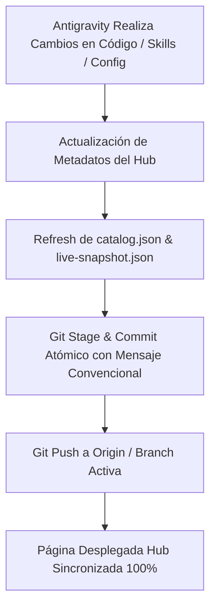

# PROTOCOLO DE SINCRONIZACIÓN GITHUB & HUB DESPLEGADO (.antigravity_code/SYNC_PROTOCOL.md)

## 1. Visión General
Este protocolo establece las reglas mediante las cuales cada cambio realizado por Antigravity (o cualquier agente del ecosistema) se sincroniza en tiempo real tanto en el repositorio remoto GitHub (`git@github.com:kinkydisorder/stack-hub-ias.git`) como en la página desplegada centralizada del Hub de IAs (`C:\dev\02_PROJECTS\SKILLS-FRONTEND\stack-hub-IAs\hub\index.html`).

## 2. Pasos del Flujo de Sincronización

## 3. Comandos de Activación Automática
- **Actualizar Snapshot local del Hub**:
  `powershell -ExecutionPolicy Bypass -File .antigravity_code/hooks/git-sync.ps1`
- **Verificar Estado del Repositorio**:
  `git status`
- **Sincronización Total con GitHub**:
  `git add . && git commit -m "feat(antigravity): auto-sync hub & skills" && git push origin feat/hub-v2`

## 4. Garantía del Chasis 200%
1. **Cero Desfases**: El Hub web refleja la lista exacta de skills y configuraciones activas.
2. **Historial Limpio**: Commits atómicos orientados por convenciones (feat, fix, docs, refactor, sync).
3. **Persistencia Garantizada**: Nada queda solo en memoria del chat; todo vive en el árbol Git y el Hub.
